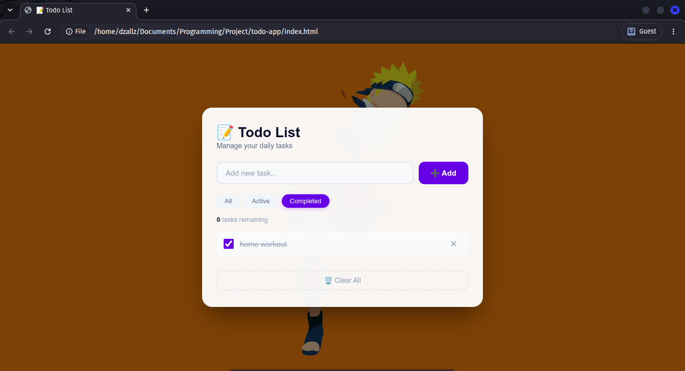

# 📝 Todo List App



A simple, clean, and functional Todo List application with beautiful background image. Built with vanilla JavaScript and LocalStorage for data persistence.

## ✨ Features

- ✅ Add new tasks
- ✅ Mark tasks as complete/incomplete
- ✅ Delete individual tasks
- ✅ Filter tasks (All / Active / Completed)
- ✅ Task counter
- ✅ Clear all tasks with confirmation
- ✅ Persistent storage (LocalStorage)
- ✅ Beautiful background image
- ✅ Glassmorphism design
- ✅ Responsive and mobile-friendly

## 🛠️ Tech Stack

| Tech | Description |
|------|-------------|
| HTML5 | Structure |
| CSS3 | Glassmorphism, Flexbox, Animations |
| JavaScript (ES6+) | Logic & Interactivity |
| LocalStorage API | Data persistence |

## 📸 Screenshot

### Desktop View


## 🚀 Live Demo

🔗 [View Demo](https://dzallzafzal47.github.io/todo-app/)

## 📦 Installation

```bash
# Clone this repository
git clone https://github.com/username/todo-app.git

# Navigate to project folder
cd todo-app

# Open in browser
open index.html
